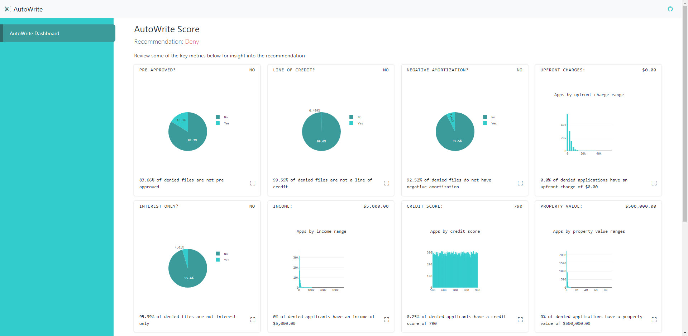

# Data Science Nano Degree
## Project: Capstone

### Motivation
Need for an AI underwriting assistant that could overlay the guidelines and give additional insights not immediately
obvious from the application.

### Project definition
Take a loan default dataset, ETL it and then load it into a Multilayer Perceptron NN. Then using the trained data give
insights into new mortgage application data and provide a recommendation underwriting action.

### Analysis
This is a POC and is not ready for production. The dataset while good enough for getting this off the ground is only for
a single year and is not evenly distributed. That being said this will predict with 99% accuracy. That prediction is
against unbalanced data though. Further development of this data set is needed before this can be used in a production
environment.

### Fair credit reporting
Three labels in this dataset were dropped in order to prevent running into FCRA violations. Gender, age and region were
removed from the data before training the model. This is because credit cannot be issued based on these labels. Training
the model with these labels could have resulted in disparate impact or treatment which could be an FCRA violation.

### Results
Classification report:
```
              precision    recall  f1-score   support

           0       1.00      1.00      1.00     33702
           1       1.00      1.00      1.00     10899

    accuracy                           1.00     44601
   macro avg       1.00      1.00      1.00     44601
weighted avg       1.00      1.00      1.00     44601
```

R-squared score:

```
0.9997571532671935
```

Confusion matrix:


### Conclusion
This is an interesting concept that warrants further exploration and refinement. With the goal of being an overlay to
underwriting regulations this system could augment the underwriting pipelines of financial institutions,
and reduce costs and risk.

### Project Details
#### Web App
[https://autowrite.benpayne.dev](https://autowrite.benpayne.dev)

Fill in the form fields and click 'AutoWrite'


1. You'll get a dashboard with various key metrics and how they compare with similar apps with the recommendation.
2. Clicking the full screen icon in the lower right corner will expand the graph to make it easier to explore.
3. Clicking the 'AutoWrite Dashboard' link on the left will bring you back to the form



#### Scripts
Activate venv for your environment, install the dependencies and run the scripts

Unix/macOS
```bash
source venv/bin/activate

which python

python -m pip install -r requirements.txt

python data/process_data.py
python models/train_classifier.py
```

Windows
```bash
.\venv\Scripts\activate

where python

python -m pip install -r requirements.txt

python data\process_data.py
python models\train_classifier.py
```

### Project Files
```
project
│   .gitattributes
│   .gitignore
│   etl_notebook.ipynb      - ETL notebook for processing the data
│   etl_notebook.py         - ETL notebook in Python script format
│   Procfile                - Heroku app runtime
│   README.md               - Readme file
│   report.pdf              - Project report
│   report-notebook.ipynb   - Readme file
│   requirements.txt        - project libraries (py -m pip install -r requirements.txt)
│
└───data
│   │   confusion_matrix.png    - Confusion matrix artifact for reporting
│   │   data.csv                - Input data
│   │   process_data.py         - ETL script
│   │   processed_data.csv      - ETL'd data...ready for modeling
│   
└───models
│   │   model.sav               - Pickled model from train_classifier.py script
│   │   train_classifier.py     - Load processed_data.csv and train an ML model
│   
└───web
│   │
│   └───providers
│       │   ResultsProvider.py  - Notes and data provider for the results page
│       
│   └───static
│       │   accounting.min.js   - accounting js library
│       │   favicon.ico         - icon for browser tab
│       │   favicon-16x16.ico   - 2x icon for browser tab
│       │   favicon-16x16.ico   - 2x icon for browser tab
│       │   icon.png            - AutoWrite icon
│       │   jquery.mak.min.js   - input mask js library
│       │   scripts.js          - application js code
│       │   site.webmanifest    - PWA file
│       │   styles.css          - appliation stylesheet
│       
│   └───templates
│       │   index.html          - main web application page
│       │   master.html         - master Jinja2 template
│       │   results.html        - results web application page
```

### Libraries
[Scikit-Learn](https://scikit-learn.org/stable/index.html)

[Pandas](https://pandas.pydata.org/)

[NumPy](https://numpy.org/)

[Flask](https://flask.palletsprojects.com/en/2.1.x/)

[Matplotlib](https://matplotlib.org/stable/index.html)

[Plotly Javascript](https://plotly.com/javascript/)

[Seaborn](https://seaborn.pydata.org/)

### Resources
[Loan Default Dataset](https://www.kaggle.com/datasets/yasserh/loan-default-dataset)

[Fair Credit Reporting Act](https://www.experian.com/blogs/ask-experian/credit-education/report-basics/fair-credit-reporting-act-fcra/#:~:text=The%20Fair%20Credit%20Reporting%20Act%20(FCRA)%20is%20a%20federal%20law,collect%20in%20your%20consumer%20reports.)